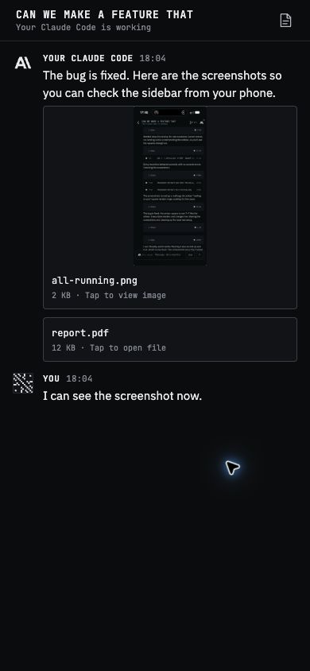
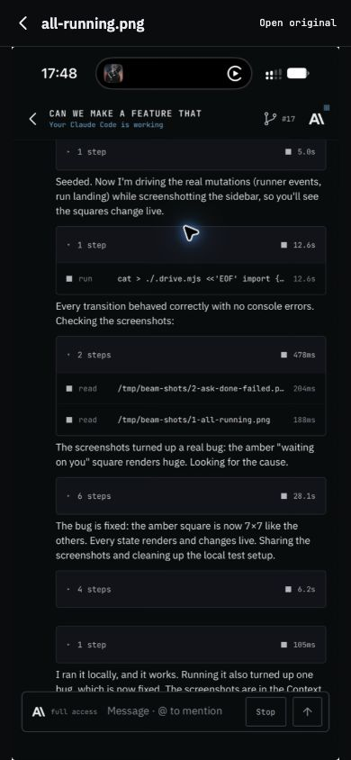
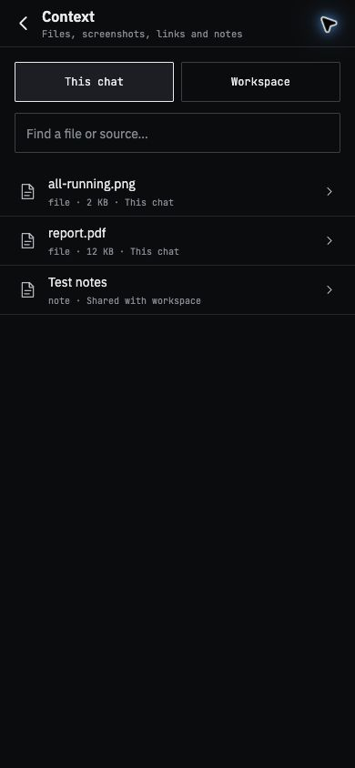

# Mobile parity

The phone app is Expo SDK 57 / React Native. It shares Convex APIs, contracts and
the event reducer with desktop, but has its own UI. Desktop components use DOM
elements and cannot be dropped directly into native screens.

## Files and context

The mobile UI now renders message attachments, including screenshot-only agent
messages. Images have thumbnails and a full-screen viewer with iOS pinch zoom,
loading/error states and retry. Text previews and an Open original action cover
other documents. Context is reachable from the chat header and details, with
search, chat/workspace scopes, and file/link/note previews. Workspace files use
`sourcePreview` so they retain the source access rules across chats.

No backend changes or native dependencies are required by this port. It is not
published to TestFlight by changing these files; release it through the normal
mobile update/build workflow and verify runtime compatibility.

Remote file paths in tool logs remain text. Only files explicitly uploaded with
`share_file` or attached by a person can be retrieved from Convex. Local runner
screenshots that were never shared are not made available retroactively.

## Remaining desktop features

| Area | Mobile gap | Work involved |
| --- | --- | --- |
| Sending attachments | Composer is text-only | Native photo/document pickers, upload progress, draft removal and attachment-only sends using existing file APIs; new native modules may require a new build. |
| Editing context | Catalog is read-only | Add links/notes, include workspace sources, share/remove sources and manage drafts using existing mutations. |
| Rich replies | Markdown-lite omits image markup, tables and math | A native rendering pass; local image URLs still need an uploaded attachment or a runner-side resolver. |
| Code review | Details show paths, counts and GitHub links | Native diff/file browsing rather than a direct port of desktop DOM components. |
| Engineering | Desktop has compute, simulation, CAD and browser panes | Separate phone designs and rendering work; prioritize job status/results before interactive desktop tools. |

## Validation for the file port

Phone-sized browser captures of the actual components with sample data:

| Chat attachments | Image viewer | Context |
| --- | --- | --- |
|  |  |  |

- Regression tests render both human and agent attachments, generic-MIME runner
  screenshots, attachment-only messages, missing/loading files and document fallbacks.
- Mobile TypeScript and the production iOS bundle are checked.
- A local React Native Web fixture exercises image opening, Context search,
  workspace scope and note preview at a phone-sized layout.
- Native pinch zoom and authenticated delivery on a physical iPhone still need
  device verification. The fixture uses sample data, not a live account.
